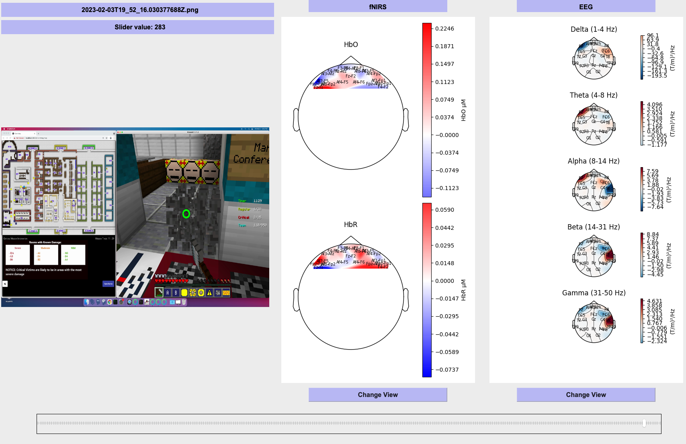

# ToMCAT-Offline-Viz
Advance Data Vizualization Project

Date: May 23, 2023

## Overview

The tool will allow researchers to superimpose eye-tracking data onto screenshots, providing insights into where team members direct their visual attention, while also displaying functional Near-Infrared Spectroscopy (fNIRS) [4] and Electroencephalography (EEG) [3] data on the right-hand side of the screen, providing information on neural activity. To further enhance visualization and facilitate analysis of variations, a slider can be utilized to compare the continuous changes.

The aims of this research are:
* Develop an innovative and user-friendly visualization tool to analyze multiple modalities including eye-tracking, fNIRS, and EEG, to provide a comprehensive understanding of the cognitive and neural mechanisms underlying teamwork.
* Enabling researchers to gain insights by providing a compact approach to visualizing complex data, which includes where team members direct their visual attention and how effective their coordination is by showing the change of trend in physiological data.
* Aiding the development of effective AI agents for team coordination and global team optimization.



*Fig. 1*: *ToMCAT-Offline-Viz tool*.

Note: As the project remains within the University, the necessary data to operate the tool has not been revealed.

#### Technology
Programming language: Python 3.9
Libraries: PyQt, CV2, Pandas, Matplotlib, MNE-Python PyQt5 is a cross-platform GUI toolkit that will help us to develop an interactive desktop application. CV2 is an OpenCV package for Python that serves for image loading, image compression, etc. Pandas will be used to load data from CSV files allowing the working of “relational” or “labeled” data.
Matplotlib would allow us to create static, animated, and interactive visualizations. MNE-Python might be used for a topological view of the brain for EEG and fNIRS signals.

## Setup the project
Install the necessary packages using `pip`
```bash
pip install -r requirements.txt
```
**or** using `conda`
```bash
conda install --file requirements.txt
```

## Launching the application
Currently we are working in modules there you have execute screen_eye_tracker_slider.py and fnirs_slider.py seperatly using the following command:
```bash
python3 screenshot_eye_track_slider.py
```
**and** 
```bash
python3 fnirs_slider.py
```

## Demo:
Screen recording of screenshot_eye_track_slider.py and fnirs_slider.py can be viewed in the demo folder. 
